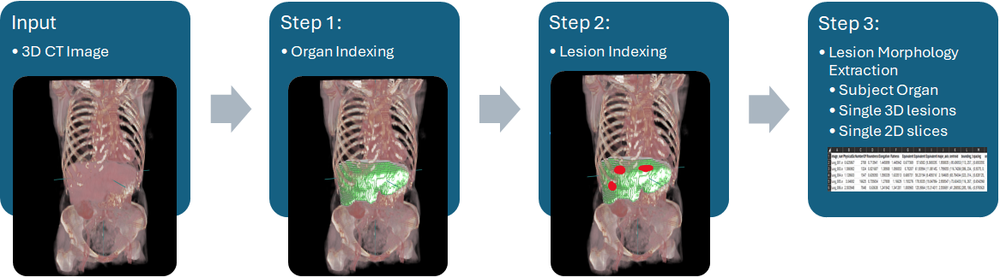
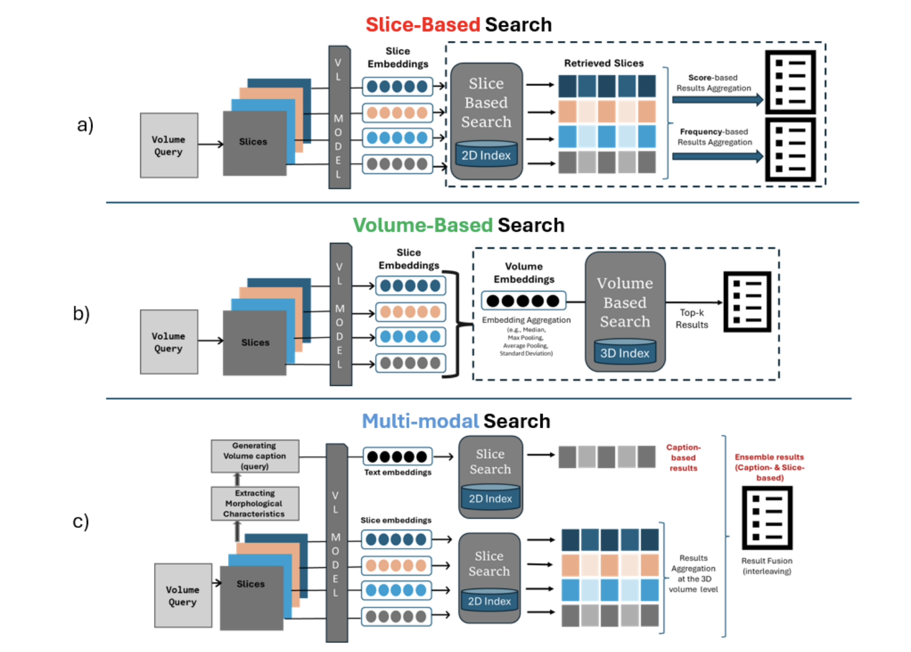

# 3D-MIR: A Benchmark & Empirical Study on 3D Medical Image Retrieval in Radiology

**Paper**: https://arxiv.org/pdf/2311.13752.pdf 

**Data:**

- Images: We use [Medical Segmentation Decathlon](http://medicaldecathlon.com/) corresponding to four organs: Colon, Liver, Lung, and Pancreas.
- 3D-MIR labels and generated captions: [https://github.com/abachaa/3D-MIR/tree/main/Data/3DMIR_labels](https://github.com/abachaa/3D-MIR/tree/main/Data/3DMIR_labels)
- Training/test splits: [https://github.com/abachaa/3D-MIR/tree/main/Data](https://github.com/abachaa/3D-MIR/tree/main/Data/Data_Splits)

**Code:**

**1) Organ Segmentation:** We use  [Total Segmentator](https://github.com/wasserth/TotalSegmentator) to segment and index individual organs.
- (a) **Organ Segmentation:** [run_totalsegmentator.py](./Code/Image-Processing-and-Quantification/run_totalsegmentator.py)

**2) Image Processing and Quantification**

- (a) **Liver Quantification:** [msd_colon_2D_3D_metrics_extraction.ipynb](./Code/Image-Processing-and-Quantification/msd_colon_2D_3D_metrics_extraction.ipynb)

- (b) **Pancreas Quantification:** [msd_pancreas_2D_3D_metrics_extraction.ipynb](./Code/Image-Processing-and-Quantification/msd_pancreas_2D_3D_metrics_extraction.ipynb)

- (c) **Colon Quantification:** [msd_colon_2D_3D_metrics_extraction.ipynb](./Code/Image-Processing-and-Quantification/msd_colon_2D_3D_metrics_extraction.ipynb)

- (d) **Lung Quantification:** [msd_lung_2D_3D_metrics_extraction.ipynb](./Code/Image-Processing-and-Quantification/msd_lung_2D_3D_metrics_extraction.ipynb)

**3) Embeddings Generation (BiomedCLIP)**

- [Generate_BiomedCLIP_Embeddings.ipynb](./Code/EmbeddingsGeneration/Generate_BiomedCLIP_Embeddings.ipynb)

**4) Retrieval Methods & Evaluation:**

  - (a) **Slice-based Retrieval:** [Method-1-Slice-based-Retrieval.ipynb](./Code/Retrieval-Methods-and-Evaluation/Method-1-Slice-based-Retrieval.ipynb) (described in Section 4.1)
  
  - (b) **Volume-based Retrieval:** [Method-2-Volume-based-Retrieval.ipynb](./Code/Retrieval-Methods-and-Evaluation/Method-2-Volume-based-Retrieval.ipynb) (described in Section 4.2)
  
  - (c) **Multi-modal Retrieval:** [Method-3-Multimodal-Retrieval.ipynb](./Code/Retrieval-Methods-and-Evaluation/Method-3-Multimodal-Retrieval.ipynb) (described in Section 4.3)
    and [GPT-4-based captions](https://github.com/abachaa/3D-MIR/tree/main/Code/Retrieval-Methods-and-Evaluation/msd_gpt4_captions)

