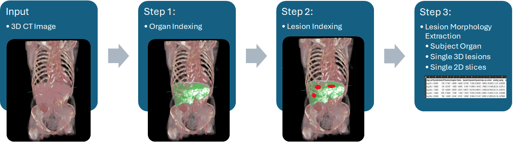
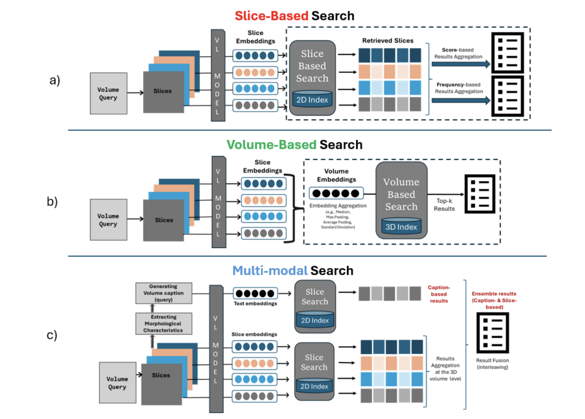

# 3D-MIR: Benchmarks and Methods for 3D Medical Image Retrieval

> **Paper:** [Benchmarks and methods for 3D medical image retrieval](https://www.nature.com/articles/s41598-026-38473-z) - Ben Abacha, A., Santamaría-Pang, A., Lee, H.H. et al. Sci Rep 16, 21016 (2026). https://doi.org/10.1038/s41598-026-38473-z 

## <h2>Data</h2> 

- Images: We use [Medical Segmentation Decathlon](http://medicaldecathlon.com/) corresponding to four organs: Colon, Liver, Lung, and Pancreas.
- 3D-MIR labels and generated captions: [https://github.com/abachaa/3D-MIR/tree/main/Data/3DMIR_labels](https://github.com/abachaa/3D-MIR/tree/main/Data/3DMIR_labels)
- Training/test splits: [https://github.com/abachaa/3D-MIR/tree/main/Data](https://github.com/abachaa/3D-MIR/tree/main/Data/Data_Splits)

## <h2>Code</h2>

**1) Organ Segmentation:** We use  [Total Segmentator](https://github.com/wasserth/TotalSegmentator) to segment and index individual organs.
- (a) **Organ Segmentation:** [run_totalsegmentator.py](./Code/Image-Processing-and-Quantification/run_totalsegmentator.py)

**2) Image Processing and Quantification**

- (a) **Liver Quantification:** [msd_colon_2D_3D_metrics_extraction.ipynb](./Code/Image-Processing-and-Quantification/msd_colon_2D_3D_metrics_extraction.ipynb)

- (b) **Pancreas Quantification:** [msd_pancreas_2D_3D_metrics_extraction.ipynb](./Code/Image-Processing-and-Quantification/msd_pancreas_2D_3D_metrics_extraction.ipynb)

- (c) **Colon Quantification:** [msd_colon_2D_3D_metrics_extraction.ipynb](./Code/Image-Processing-and-Quantification/msd_colon_2D_3D_metrics_extraction.ipynb)

- (d) **Lung Quantification:** [msd_lung_2D_3D_metrics_extraction.ipynb](./Code/Image-Processing-and-Quantification/msd_lung_2D_3D_metrics_extraction.ipynb)

**3) Embeddings Generation (BiomedCLIP)**

- [Generate_BiomedCLIP_Embeddings.ipynb](./Code/EmbeddingsGeneration/Generate_BiomedCLIP_Embeddings.ipynb)

**4) Retrieval Methods & Evaluation:**

  - (a) **Slice-based Retrieval:** [Method-1-Slice-based-Retrieval.ipynb](./Code/Retrieval-Methods-and-Evaluation/Method-1-Slice-based-Retrieval.ipynb) (described in Section 4.1)
  
  - (b) **Volume-based Retrieval:** [Method-2-Volume-based-Retrieval.ipynb](./Code/Retrieval-Methods-and-Evaluation/Method-2-Volume-based-Retrieval.ipynb) (described in Section 4.2)
  
  - (c) **Multi-modal Retrieval:** [Method-3-Multimodal-Retrieval.ipynb](./Code/Retrieval-Methods-and-Evaluation/Method-3-Multimodal-Retrieval.ipynb) (described in Section 4.3)
    and [GPT-4-based captions](https://github.com/abachaa/3D-MIR/tree/main/Code/Retrieval-Methods-and-Evaluation/msd_gpt4_captions)

## <h2>Related Resources</h2>

* **Blog post:** An overview of the 3D image retrieval pipeline built with the MedImageInsight foundation model, including volumetric image embedding generation, feature indexing, and similarity search: https://aka.ms/3DImageSearch 
* **Jupyter notebook:** An end-to-end implementation demonstrating 3D medical image embedding extraction with MedImageInsight, vector index construction, and semantic image retrieval. Available in the Microsoft healthcareai-examples GitHub repository: https://aka.ms/healthcare-ai-examples-mi2-3d-image-search 

## <h2>License</h2>
- This work is released under the Creative Commons Attribution 4.0 International License ([CC BY 4.0](https://creativecommons.org/licenses/by/4.0/)). Please cite our paper if you use the 3D-MIR dataset or code:  
  
        @article{3d-mir, 
        author = {Ben Abacha, Asma and Santamar{\'i}a-Pang, Alberto and Lee, Ho Hin and Merkow, Jameson and Cai, Qin and Devarakonda, Surya Teja and Islam, Abdullah and Gong, Julia and Lungren, Matthew and Forghani, Reza and Jindal, Ankush and Lin, Thomas and Codella, Noel C. F. and Tarapov, Ivan},
        title = {Benchmarks and methods for 3D medical image retrieval},
        journal = {Scientific Reports},
        year = {2026}, 
        volume = {16},
        number = {1},
        pages = {21016},
        doi = {10.1038/s41598-026-38473-z},
        url = {https://doi.org/10.1038/s41598-026-38473-z},
        issn = {2045-2322},
        abstract = {The increasing use of medical imaging in healthcare settings presents a significant challenge due to the additional workload for radiologists, yet it also offers opportunity for enhancing healthcare outcomes if effectively leveraged. Artificial Intelligence (AI)-based 3D medical image retrieval holds the potential to alleviate radiologists’ burden by offering evidence-based diagnostics and predictions that can enhance the scale and accuracy of radiologists’ work, while simultaneously supporting output verification for safety and regulatory compliance. Despite its promise, the field of 3D medical image retrieval lacks established evaluation benchmarks, comprehensive datasets, and rigorous evaluation studies. This paper aims to address these gaps by introducing the first benchmark for 3D Medical Image Retrieval (3D-MIR) and evaluating various pre-trained models and implementation approaches for retrieval. The benchmark includes four anatomies (Liver, Colon, Pancreas, and Lung) imaged using computed tomography (CT). A range of 3D image search strategies are explored, including those that use aggregated 2D slices/3D volumes (Image-to-Image) and text embeddings from popular foundation models as queries (Text-to-Image). Additionally, novel multi-modal and supervised fine-tuning approaches are investigated to generate multi-modal embeddings for 3D image retrieval. The paper provides quantitative and qualitative assessments of each approach, along with an in-depth discussion offering insights for future research and solutions to support clinical decision-making and healthcare applications. To foster advancement in this field, our benchmark, models, and code are made publicly available.}
        }

## <h2>Contact</h2>

    -  Asma Ben abacha (abenabacha at microsoft dot com) 
    -  Alberto Santamaría-Pang (alberto dot santamariapang at microsoft dot com) 
----
